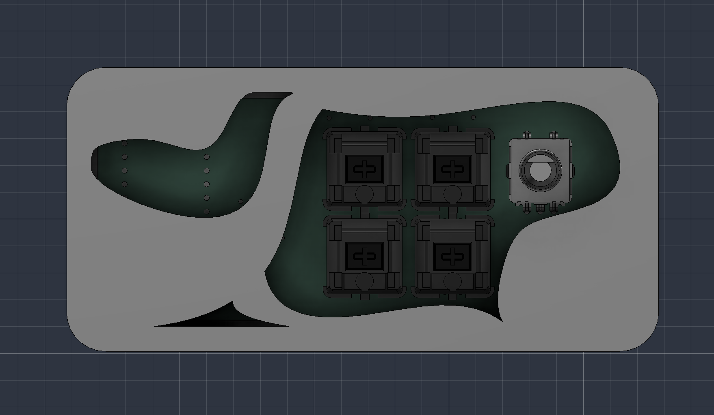
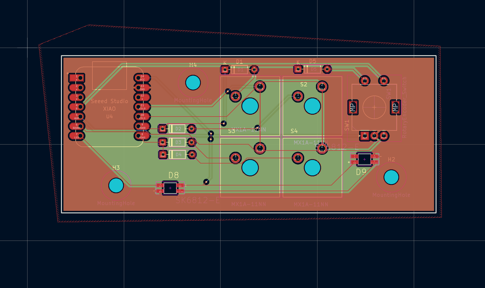

# Taz Pad
Taz pad is a 4 key macropad, has 2 LED and works with kmk firmware.

## Firmware:
- An EC11 Rotary encoder to change volume and to mute.
- A switch to open gmail.
- A switch to open calculator.
- 2 WS2812B RGB LEDs. Both diffusing across the display.
- 4 Cherry MX-style keys.

## CAD:
The case is composed of 2 different parts. The Top and the Bottom
The case fits together with 3 M6 screws.

Top CAD

Bottom CAD

## PCB:
Here is my pcb made in KiCad

## Firmware:
This macro pad uses KMK
- the rotary encoder changes the volume, press to mute.
- Copy, Paste, Gmail, and calculator button.

## BOM:
- 4x Cherry MX Switches
- 4x DSA Keycaps
- 3x M3x16mm screws
- 5x 1N4148 DO-35 Diodes.
- 2x WS2812B LEDs
- 1x EC11 Rotary Encoder
- 1x XIAO RP2040
- 1x Case (2 printed parts)
